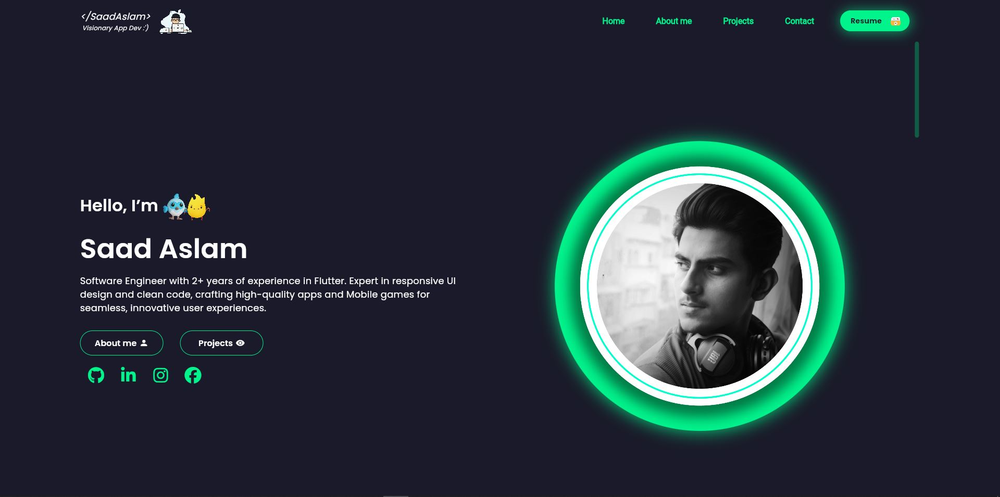
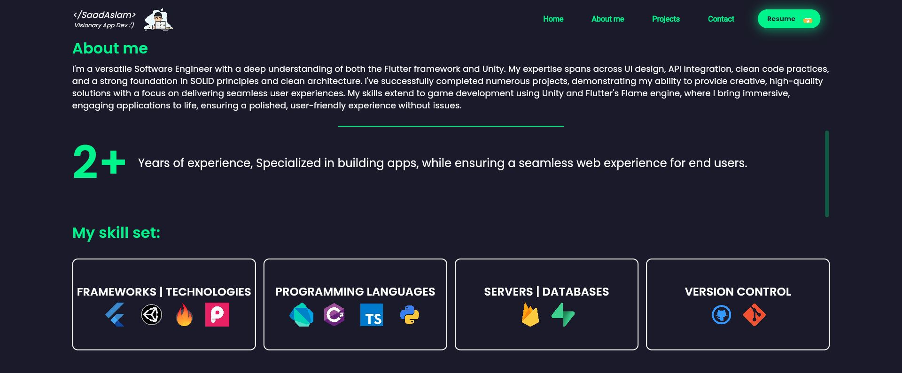
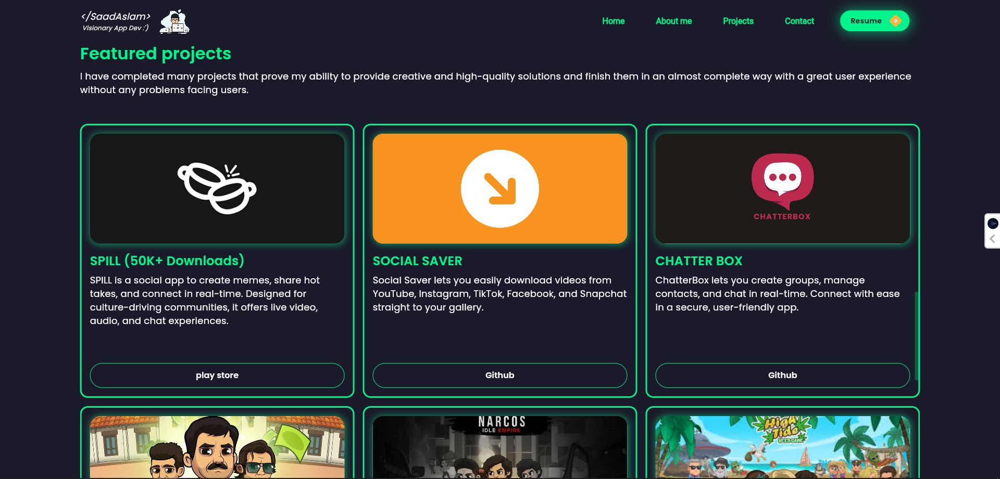
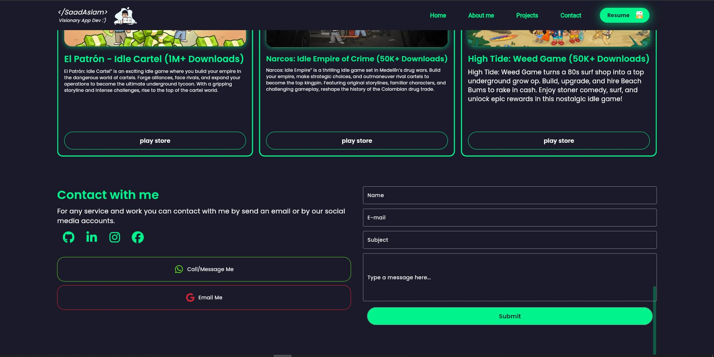
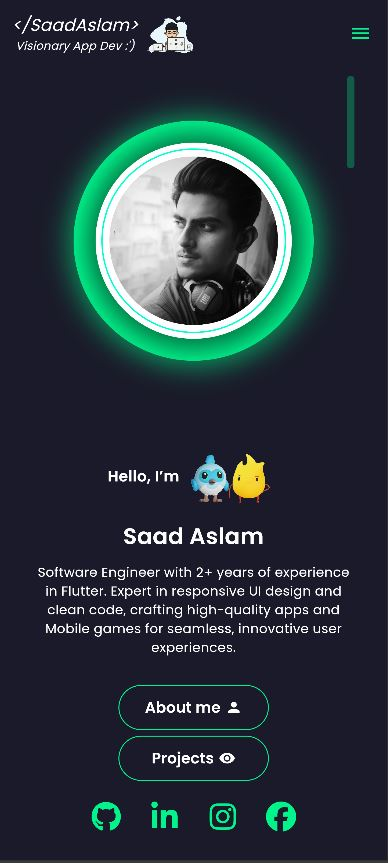
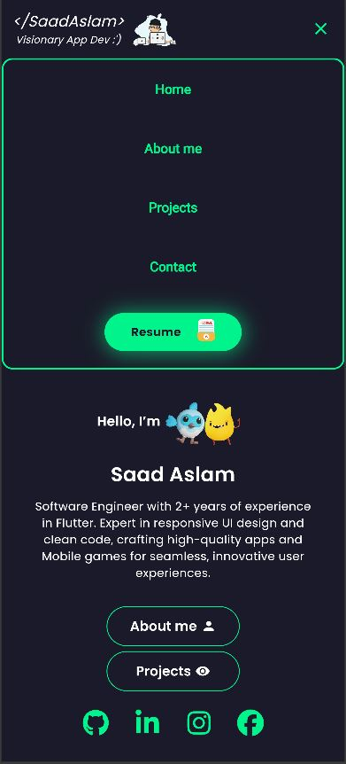

# Portfolio: Flutter Web Portfolio

This is a stunning Flutter Web portfolio, meticulously crafted based on a Figma design and elegantly hosted on Firebase.

## 🌐 Live URL
Explore the live portfolio: [https://saadaslam-portfolio.web.app/](https://saadaslam-portfolio.web.app/)

## 💻 Requirements
To tinker with this project, you'll need the following:
- Any Operating System (MacOS, Linux, Windows)
- An Integrated Development Environment (IDE) with Flutter SDK installed (Android Studio, VSCode, etc.)
- A basic understanding of Dart and Flutter.

## 👨‍💻 How to Run
Here's how to get the portfolio up and running:
1. Clone the repository: [GitHub Repository](git@github.com:saadaslamdev/flutter_web_portfolio.git)
2. Run the project in your browser using the command:
   ```
   flutter run -d chrome
   ```

## 📷 Previews

- Home
  

- About
  

- Projects 
  

- Contact
  

## 📱 Mobile Home Screenshot
Here's a peek at the mobile version of the home page:

   
   
